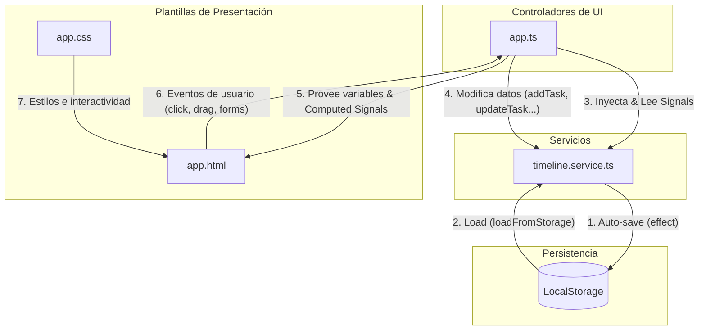

# 🏛️ Arquitectura del Sistema

Esta sección describe la arquitectura técnica del planificador temporal. La aplicación está desarrollada utilizando una estructura de componente único principal asistido por un servicio de persistencia y estado global de Angular.

---

## 🏗️ Diagrama de Componentes e Interacción

El flujo de información y responsabilidades sigue un patrón unidireccional y reactivo basado en Angular Signals:

---

## 📦 Desglose de Componentes

### 1. Estado Global: `TimelineService`
El archivo [timeline.service.ts](file:///Users/fmanzano/Projects/issues-views/src/app/services/timeline.service.ts) encapsula el estado global de la aplicación.
* **Signals de Estado**: Mantiene tres señales reactivas principales:
  - `users`: Lista de usuarios activos.
  - `projects`: Lista de proyectos activos.
  - `tasks`: Lista de tareas en la línea de tiempo.
* **Persistencia Reactiva**: Utiliza tres bloques `effect` en su constructor que monitorizan los cambios en las señales y actualizan automáticamente el `LocalStorage`.
* **Inicialización (Seed Data)**: Si el almacenamiento local está vacío, pre-carga el planificador con usuarios, proyectos y tareas por defecto con relaciones establecidas para fines de demostración.
* **Integridad Referencial (Borrado en Cascada)**:
  - Al borrar un usuario, elimina sus tareas y limpia su ID de cualquier proyecto donde estuviera asignado como `defaultUserId`.
  - Al borrar un proyecto, elimina automáticamente todas las tareas asociadas.

### 2. Controlador de Presentación: `App` Component
Definido en [app.ts](file:///Users/fmanzano/Projects/issues-views/src/app/app.ts), se encarga de la lógica fina de interfaz y procesamiento temporal:
* **Layouts Computados (`computed`)**:
  - `userLayouts`: Calcula la distribución vertical (apilamiento en pistas) de las tareas de cada usuario para evitar solapamientos visuales.
  - `userRowOffsets`: Calcula el desplazamiento en pixeles vertical acumulado por fila de usuario, necesario para pintar las líneas SVG de dependencias.
  - `dependencyLines`: Genera las rutas curvas Bézier en SVG para conectar las tareas predecesoras con sus sucesoras en tiempo real.
* **Gestión de Drag & Drop**: Captura eventos nativos de HTML5, calcula el snapping (ajuste a la rejilla horaria de 9:00 a 17:00), valida las dependencias temporales y actualiza el servicio.
* **Controles Visuales**: Modales de Tarea, Usuario y Proyecto, y el porcentaje dinámico de escala horizontal (zoom).

---

## 🔗 Relación de Archivos
* [[DataModels|Modelos de Datos]]: Estructuras de datos intercambiadas entre componentes.
* [[BusinessLogic|Lógica de Negocio]]: Algoritmos internos de cálculo del grid, validación y periodicidad.
* [[DeveloperGuide|Guía del Desarrollador]]: Estructura técnica de Angular y reactividad.
