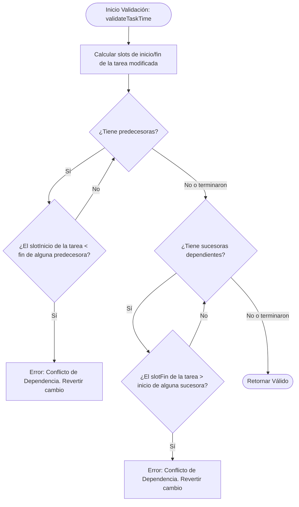

# 🧠 Lógica de Negocio y Algoritmos

Este documento expone las reglas de negocio temporales de la aplicación y detalla los algoritmos utilizados para posicionar tareas, evitar solapamientos visuales y validar restricciones de dependencias.

---

## 📅 Escala Temporal y Rejilla (Slots)

El planificador maneja una escala de **5 días laborables** (Lunes a Viernes) y **8 horas diarias** (09:00 a 17:00). Esto da un total de **40 slots temporales** a la semana.

* **Conversión a Slot Lineal**:
  $$\text{Slot} = (\text{Día} \times 8) + (\text{Hora} - 9)$$
  - *Lunes 09:00* $\rightarrow$ Slot `0`
  - *Lunes 17:00* $\rightarrow$ Slot `8` (fin de jornada, no de inicio)
  - *Viernes 16:00* $\rightarrow$ Slot `39` (último slot de inicio disponible)
* **Duración**: La duración se expresa en horas decimales (ej. `2`, `4.5`), lo que permite que una tarea ocupe fracciones de slots.

---

## 🥞 Algoritmo de Apilamiento de Tareas (Solapamiento)

Para permitir que un usuario tenga múltiples tareas asignadas a la misma hora sin que se solapen visualmente, el sistema implementa una señal computada llamada `userLayouts` en [app.ts](file:///Users/fmanzano/Projects/issues-views/src/app/app.ts):

1. **Agrupación y Ordenamiento**: Filtra las tareas de cada usuario y las ordena de forma ascendente por su slot de inicio.
2. **Algoritmo Codicioso de Pistas**:
   - Mantiene una lista `trackEndSlots` donde el índice de la lista representa una pista vertical (0, 1, 2...) y el valor representa el slot en el que termina la última tarea asignada a esa pista.
   - Para cada tarea, busca secuencialmente en `trackEndSlots` la primera pista libre (donde el slot de inicio de la tarea actual sea mayor o igual al slot de término registrado en esa pista).
   - Registra el nuevo slot de término de la tarea en esa pista.
3. **Cálculo de Posición**:
   - `left` (porcentaje) = $(\text{slotInicio} / \text{totalSlots}) \times 100$
   - `width` (porcentaje) = $(\text{duración} / \text{totalSlots}) \times 100$
   - `top` (píxeles) = $(\text{pistaAsignada} \times 60) + 8$
4. **Cálculo de Altura**: La altura total de la fila del usuario se expande a $\max(80, \text{totalPistas} \times 60 + 16)\text{ px}$.

---

## 🔗 Validación de Dependencias Temporales

Una tarea puede depender de una o más tareas predecesoras. El sistema de validación implementa las siguientes restricciones estrictas:

### 1. Detección de Dependencias Circulares (Bucles)
Al asociar dependencias en el modal, el método `hasDependencyPath(fromId, toId)` realiza una búsqueda en profundidad (DFS) recursiva para comprobar si existe un camino de dependencias inverso. Si existe, inhabilita o filtra el candidato en el buscador de autocompletado para evitar que el usuario cree un bloqueo infinito de tareas.

---

## 🔁 Lógica de Periodicidad (Recurrencia)

Al crear tareas recurrentes (Diaria, Cada 6h, Cada 12h), el sistema calcula las instancias futuras basándose únicamente en horas laborables:

1. Calcula la hora real acumulada de la primera tarea: $\text{HoraReal} = \text{Día} \times 24 + \text{HoraInicio}$.
2. Entra en un bucle que incrementa la hora real por el intervalo elegido.
3. **Filtro de Horas Laborables**:
   - Si la hora del slot resultante cae entre las **09:00 y las 17:00**, crea una copia de la tarea en ese slot.
   - Si cae fuera del horario laboral o en fin de semana, **salta automáticamente al inicio de la siguiente jornada laboral** (09:00 del día siguiente).
4. El ciclo se detiene al llegar al límite del final del Viernes a las 17:00 (límite del planificador).
