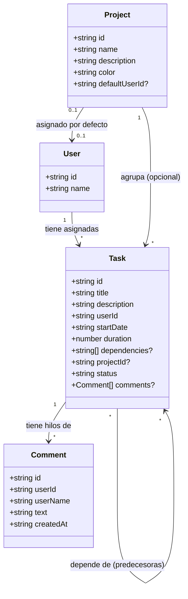

# 💾 Modelos de Datos

La aplicación utiliza interfaces TypeScript fuertemente tipadas para modelar las entidades del negocio. La integridad de las relaciones se mantiene en la capa del servicio (`TimelineService`).

---

## 📐 Estructura de Entidades

Las interfaces principales están definidas en [types.ts](file:///Users/fmanzano/Projects/issues-views/src/app/models/types.ts):



---

## 📝 Detalles de Interfaces

### 1. Usuario (`User`)
Representa a los miembros del equipo que ejecutan tareas en el planificador.
```typescript
export interface User {
  id: string;   // Identificador único UUID
  name: string; // Nombre visible
}
```

### 2. Proyecto (`Project`)
Permite agrupar tareas bajo una iniciativa común y colorear su visualización.
```typescript
export interface Project {
  id: string;            // Identificador único UUID
  name: string;          // Nombre del proyecto
  description: string;   // Propósito o metas
  color: string;         // Color hexadecimal curado para tema oscuro
  defaultUserId?: string; // ID del usuario por defecto para nuevas tareas asignadas a este proyecto
}
```

### 3. Comentario (`Comment`)
Modelo para los comentarios de tareas.
```typescript
export interface Comment {
  id: string;        // Identificador único UUID
  userId: string;    // ID del autor del comentario
  userName: string;  // Nombre del autor del comentario
  text: string;      // Mensaje
  createdAt: string; // Timestamp ISO
}
```

### 4. Tarea (`Task`)
Entidad central que ubica bloques de trabajo en la franja temporal.
```typescript
export interface Task {
  id: string;              // Identificador único UUID
  title: string;           // Título breve de la tarea
  description: string;     // Detalles de la tarea
  userId: string;          // Relación con el User asignado
  startDate: string;       // Fecha y hora local ISO (ej. 'YYYY-MM-DDTHH:00:00')
  duration: number;        // Duración en horas laborables (ej. 1, 2, 4)
  dependencies?: string[]; // Lista de IDs de tareas que deben finalizar antes
  projectId?: string;      // Relación opcional con un Project
  status: TaskStatus;      // Estado de la tarea: 'Creado' | 'En proceso' | 'Cancelado' | 'Terminado'
  comments?: Comment[];    // Comentarios/Chat de la tarea
}
```

---

## 🔒 Reglas de Integridad Referencial

El servicio `TimelineService` implementa lógica explícita para evitar registros huérfanos al realizar borrados:

1. **Eliminación en Cascada de Proyectos**:
   - Al eliminar un `Project`, se eliminan en cascada **todas** las tareas asociadas (`task.projectId === projectId`).
   - Se limpian las referencias de dependencias en las tareas restantes para evitar que busquen tareas eliminadas.
2. **Eliminación en Cascada de Usuarios**:
   - Al eliminar un `User`, se borran todas sus tareas asignadas.
   - Si dicho usuario era el asignado por defecto de algún proyecto (`project.defaultUserId === userId`), ese campo se restablece automáticamente a `undefined`.
3. **Limpieza de Dependencias**:
   - Al borrar cualquier tarea, se elimina su ID de la lista de `dependencies` de cualquier otra tarea que dependiera de ella.
