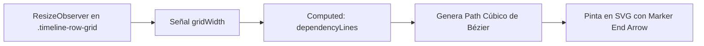

# 🎨 Sistema de Diseño y UI/UX

Este documento detalla los principios estéticos y de experiencia de usuario (UX) implementados en el planificador, incluyendo el diseño visual, el sistema de zoom, el trazado dinámico de dependencias y los formularios avanzados.

---

## 🖤 Estética Visual (Dark Theme Premium)

La interfaz de usuario utiliza una estética moderna de tema oscuro inspirada en las guías de diseño premium:

* **Tipografía**: Incorpora **Outfit** (Google Fonts) como fuente de interfaz principal, aportando un aspecto limpio, tecnológico y legible.
* **Paleta de Colores Curada**:
  - **Fondo Principal**: Slate profundo (`#0b0d19` / `#0f172a`).
  - **Paneles**: Glassmorphic translúcido (`rgba(15, 23, 42, 0.6)`) con bordes sutiles y filtros de desenfoque de fondo (`backdrop-filter: blur(12px)`).
  - **Acciones y Elementos**: Gradiente premium en botones primarios y cabecera (Indigo a Violeta a Rosa: `linear-gradient(135deg, #6366f1, #a855f7, #ec4899)`).
  - **Colores de Proyecto**: 7 colores intensificados seleccionados para alto contraste sobre fondo oscuro (Indigo, Emerald, Rose, Orange, Sky, Yellow, Crimson).

---

## 🔍 Zoom Horizontal y Acoplamiento

El zoom modifica dinámicamente la escala temporal sin alterar el alto de las celdas, permitiendo ver las tareas con mayor o menor detalle horizontal:

* **Escala de Zoom**: Va desde `0.6` (60%) hasta `3.0` (300%).
* **Control de Zoom**: Se puede manejar desde los botones de la cabecera (con reinicio rápido) o mediante la combinación **Ctrl + Rueda del Ratón** (`wheel` event).
* **Solución de Desacoplamiento (CSS Grid)**: Para evitar que el zoom descentrara el grid, las columnas se definen utilizando `minmax(0, 1fr)` en lugar de `1fr` simple, lo que impide que las celdas con textos largos empujen la cuadrícula fuera de su alineación proporcional.

---

## 〰️ Trazado Dinámico de Dependencias (SVG + ResizeObserver)

Las flechas que conectan las tareas se dibujan de forma reactiva en una capa SVG absoluta superpuesta en el planificador:

### 1. Cálculo del Ancho Dinámico
Como el zoom altera el tamaño de la cuadrícula, un cálculo de porcentaje simple desalineaba las líneas SVG durante el scroll o redimensionamiento. Para solucionarlo, un `ResizeObserver` en el componente principal mide en píxeles reales el contenedor `.timeline-row-grid` y almacena el ancho exacto en la señal `gridWidth`.

### 2. Ecuación de la Curva de Bézier
Cada línea se calcula en base a la posición de la tarea predecesora ($A$) y sucesora ($B$):
- **Inicio de la Línea ($x_1, y_1$)**: Borde derecho de la tarea $A$ (Fin de la tarea).
- **Fin de la Línea ($x_2, y_2$)**: Borde izquierdo de la tarea $B$ (Inicio de la tarea).
- **Ruta de Curvatura (Cubic Bezier)**:
  - $cp_1 = (x_1 + \Delta_{offset}, y_1)$
  - $cp_2 = (x_2 - \Delta_{offset}, y_2)$
  - Donde el desplazamiento de control $\Delta_{offset} = \max(30, |x_2 - x_1| \times 0.4)$.
  - Sendero SVG: `M x1 y1 C cp1_x cp1_y, cp2_x cp2_y, x2 y2`.

---

## 📝 Formularios y Componentes Avanzados

### 1. Modal de Tareas en Dos Columnas
Para pantallas de escritorio, el modal adopta una vista ensanchada (`max-width: 800px`) de dos columnas:
* **Izquierda (Contenido Principal)**: Título, descripción extendida y buscador de dependencias.
* **Derecha (Configuración)**: Proyecto, usuario, día, hora de inicio, duración y periodicidad.

### 2. Buscador Autocompletable de Dependencias
El control de selección de dependencias consta de:
* **Entrada de Texto**: Permite filtrar tareas candidatas disponibles.
* **Menú Desplegable**: Una lista flotante absoluta que muestra resultados que coinciden con el texto de búsqueda. Utiliza el evento `mousedown` con prevención de comportamiento predeterminado para evitar cierres prematuros antes de registrar el clic en el menú.
* **Lista de Etiquetas ("Badges / Chips")**: Las dependencias seleccionadas se muestran en una fila de píldoras sutiles con un botón de cierre rápido (`×`) que permite quitarlas de inmediato.
