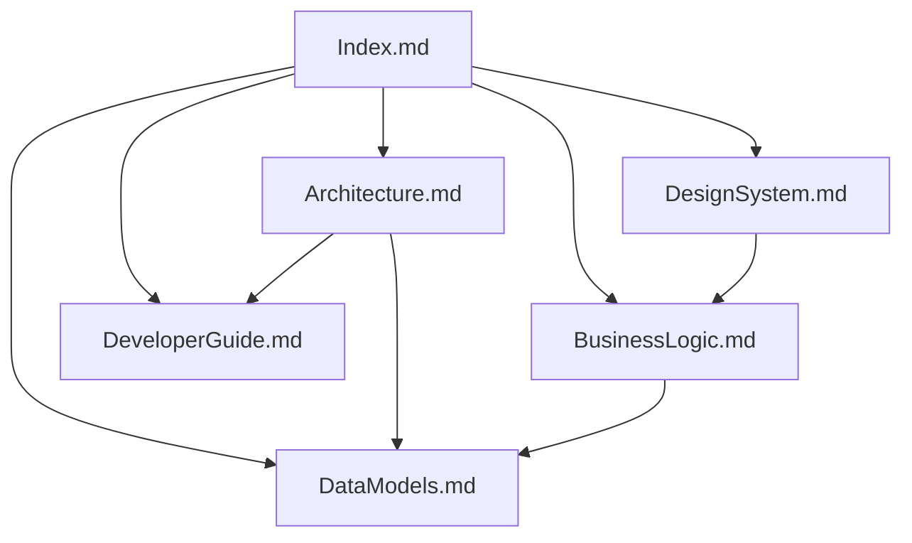

# Documentación del Proyecto: Timeline Planner MVP

Bienvenido a la base de conocimiento de la aplicación **Timeline Planner MVP**. Este espacio de documentación está diseñado en formato modular e interconectado mediante [[WikiLinks]], ideal para su navegación en la vista de grafo de **Obsidian**.

---

## 🗺️ Mapa de la Documentación

Haz clic en cualquiera de los siguientes enlaces para explorar las distintas secciones del proyecto:

* **[[Architecture|🏛️ Arquitectura del Sistema]]**
  * Descubre cómo interactúan los servicios de Angular, los componentes y la persistencia local. Incluye diagramas de componentes y flujos de datos.
* **[[DataModels|💾 Modelos de Datos]]**
  * Especificaciones de las interfaces TypeScript principales (`User`, `Project`, `Task`), sus relaciones y la integridad referencial en cascada.
* **[[BusinessLogic|🧠 Lógica de Negocio y Algoritmos]]**
  * Detalle de las reglas de negocio críticas: sistema de franjas horarias laborables, apilamiento de tareas solapadas (algoritmo codicioso), validación de dependencias temporales, detección de dependencias circulares y cálculo de periodicidad laboral.
* **[[DesignSystem|🎨 Sistema de Diseño y UI/UX]]**
  * Detalles sobre la estética visual oscura de gama premium, el comportamiento del Drag & Drop en cuadrícula, el cálculo en tiempo real de curvas de dependencias mediante SVG y ResizeObserver, el modal responsivo y el buscador autocompletable.
* **[[DeveloperGuide|💻 Guía del Desarrollador (Angular 21)]]**
  * Instrucciones técnicas sobre el desarrollo bajo Angular 21 (Zoneless + Signals), sincronización reactiva con `LocalStorage`, ciclos de vida y comandos CLI del proyecto.

---

## 📊 Vista de Grafo de Obsidian
Si abres esta carpeta como un "Vault" en Obsidian, podrás visualizar un grafo de relaciones de la siguiente forma:

